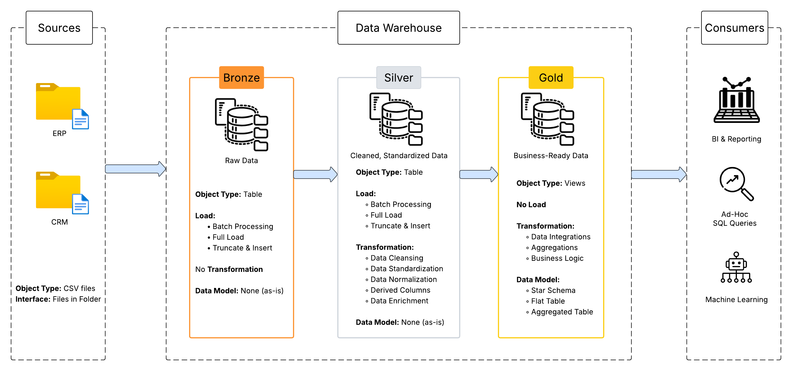
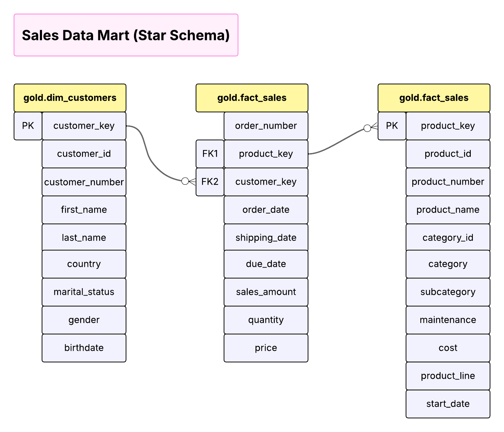

# 📦 Data Warehouse Project 🚀

Welcome to the **Data Warehouse Project** repository!

This project demonstrates the design and implementation of a modern data warehouse using SQL Server. It follows an end-to-end approach from raw data ingestion to delivering business-ready datasets for analytical reporting.

The project integrates data from CRM and ERP systems and implements the Medallion Architecture (Bronze, Silver, and Gold layers) to transform raw data into meaningful business insights.

---

## 🎯 Objectives

### ⚙️ Data Engineering Goals
- Build a modern data warehouse using SQL Server
- Ingest and consolidate data from CRM and ERP source systems
- Implement Medallion Architecture (Bronze → Silver → Gold)
- Develop robust ETL pipelines for data cleansing and transformation
- Ensure high data quality, consistency, and integrity

---

### 📌 Project Scope
- Focus on the latest available dataset (no historization)
- Batch processing with full refresh approach
- Deliver analysis-ready datasets for downstream reporting and dashboards

---

## 🛠️ Tech Stack

- SQL Server
- T-SQL
- CSV Files (CRM & ERP data sources)
- Git & GitHub

---

## 🏗️ Data Warehouse Architecture

This project follows the Medallion Architecture, a modern layered design pattern widely used in data engineering.

<p align="center">
  
</p>

### 🥉 Bronze Layer - Raw Data
- Ingests raw data from CRM and ERP systems in its original format
- Uses BULK INSERT for efficient loading
- Acts as the single source of truth for raw data
- No transformations applied

### 🥈 Silver Layer - Cleaned & Transformed Data
Responsible for data quality and standardization. Key transformations include:
- Handling null values and duplicates
- Standardizing categorical values
- Cleaning text fields and fixing inconsistent data
- Applying business rules
- Data type casting and validation

Data in this layer is clean, reliable, and ready for modeling.

### 🥇 Gold Layer - Business-Ready Data (Star Schema)
The final analytics layer structured using a Star Schema model, consisting of fact and dimension tables.

**Optimized for:**
- Fast querying and aggregations
- Business reporting and dashboards
- Supporting analytical use cases such as customer insights and sales analysis

---

## 🧠 Data Model (Star Schema)

The Gold Layer follows a Star Schema design:

<p align="center">
  
</p>

- Fact Table:
  - fact_sales (stores transactional data such as revenue and quantity)

- Dimension Tables:
  - dim_customer
  - dim_product
  - dim_date

This schema is optimized for analytical queries and reporting.

---

## 🔄 ETL (Extract, Transform, Load) Approach

**📥Extraction:**
- Source data is extracted from ERP and CRM systems in CSV format  
- Full data extraction is performed for initial data loading  

**🔧Transformation:**
- Data cleaning and standardization (handling nulls, invalid values, and formatting issues)  
- Removal of duplicates and unwanted spaces  
- Data type conversions and validation  
- Business logic implementation (e.g., product categorization, derived fields)  
- Integration of ERP and CRM datasets into a unified structure  

**📤Loading:**
- Batch processing approach is used  
- Data is loaded into Bronze, Silver, and Gold layers  
- Full load strategy (truncate and insert) is applied for initial stages

---

## 🧪 Data Quality Checks

To ensure reliability and consistency, the following checks are applied:

- Removal of duplicate records
- Handling null and missing values
- Data type validation and casting
- Standardization of inconsistent values
- Referential integrity checks between tables

---

## 📁 Project Structure

The repository is organized as follows:
```text
data-warehouse-project/
├── datasets/                                   # Raw datasets used for the project (ERP and CRM data)
├── docs/                                       # Project documentation and architecture details
│   ├── data_architecture_diagram.png           # png file shows the project's architecture 
│   ├── data_catalog.md                         # Catalog of datasets, including field descriptions and metadata
│   ├── data_flow.png                           # png file for the data flow diagram
│   ├── data_integration.png                    # png file for the data integration diagram
│   ├── data_models.png                         # png file for data models (star schema)
│   └── naming-conventions.md                   # Consistent naming guidelines for tables, columns, and files
├── scripts/                                    # SQL scripts for ETL and transformations
│   ├── init_database.sql/                      # initializes the 'DataWarehouse' database environment.
│   ├── 01_bronze/                              # Scripts for extracting and loading raw data
│   ├── 02_silver/                              # Scripts for cleaning and transforming data
│   └── 03_gold/                                # Scripts for creating analytical models
├── tests/                                      # Test scripts and quality files
├── README.md                                   # Project overview and instructions
├── LICENSE                                     # License information for the repository

---

## 🚀 How to Run the Project

1. Clone the repository  
2. Open SQL Server Management Studio (SSMS)  
3. Execute scripts in the following order:
   - init_database
   - Bronze Layer  
   - Silver Layer  
   - Gold Layer

---

## 🔮 Future Improvements

- Implement incremental data loading  
- Introduce Slowly Changing Dimensions (SCD)  
- Build dashboards using Power BI or Tableau  
- Automate ETL pipelines using scheduling tools

---

## 💡 Challenges & Learnings

- Handling inconsistent data across multiple source systems  
- Designing efficient ETL pipelines  
- Ensuring data quality and consistency  
- Structuring a scalable data warehouse architecture  
